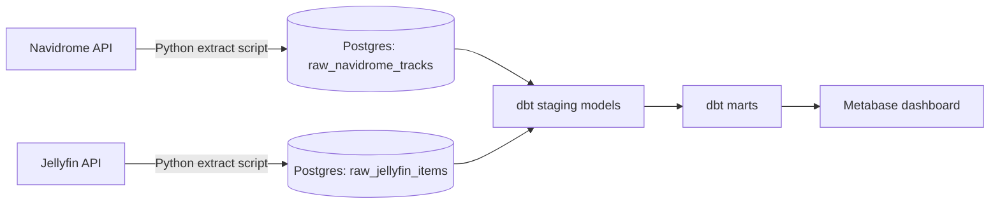

# Media Library Analytics Pipeline

An ETL pipeline that extracts library metadata from two self-hosted media servers (Navidrome for music, Jellyfin for movies/TV), loads it into a Postgres data warehouse, transforms it with dbt, and visualizes it in Metabase — all running on a self-hosted NAS.

## What it does

- Pulls full library metadata (not just play history) from the Navidrome and Jellyfin APIs
- Lands raw data in a dedicated Postgres warehouse
- Cleans and models the data with dbt, fixing real data quality issues along the way (inconsistent genre naming, malformed numeric fields, multi-value fields)
- Combines both sources into a cross-source summary, proving multi-source integration
- Visualizes everything in a Metabase dashboard

## Architecture

## How to run it

1. Stand up Postgres and Metabase via `docker-compose.yml` on the NAS
2. Set up a Python virtual environment and install dependencies from `requirements.txt`
3. Configure a `.env` file with Navidrome, Jellyfin, and Postgres credentials
4. Run the extraction scripts (`extract_navidrome.py`, `extract_jellyfin.py`) to pull data, then the load scripts to land it in Postgres
5. Run `dbt run` inside the `media_library` dbt project to build all staging and mart models
6. Open Metabase and explore the pre-built "Media Library Analytics" dashboard

## Dashboard

## Data quality notes

Several real data quality issues were identified and fixed during modelling, including inconsistent genre capitalization across sources, blank-string values not caught by standard null handling, and a multi-value comma-separated genre field requiring array unnesting.
